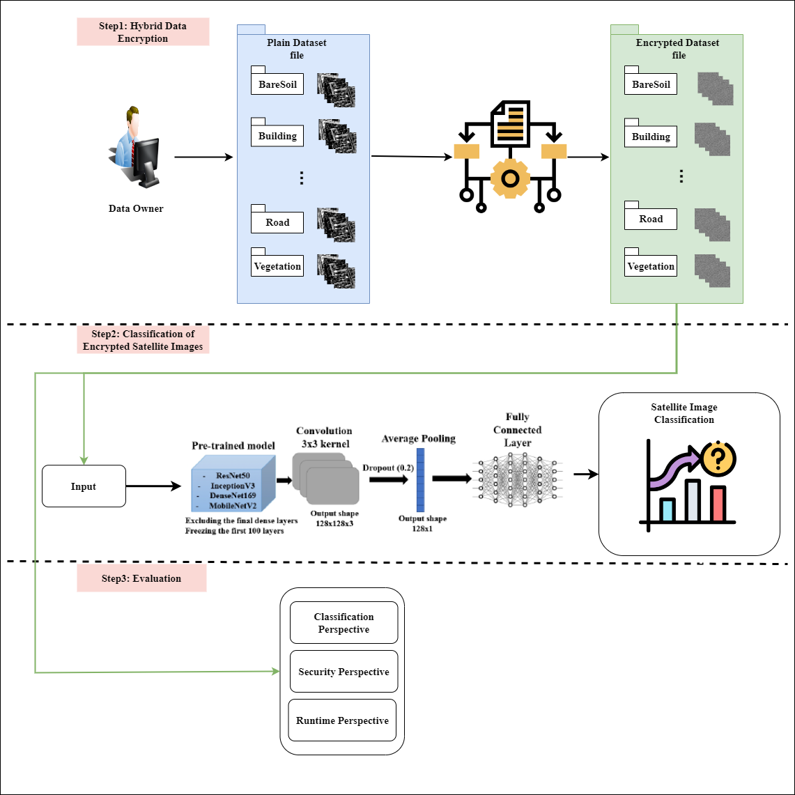

# A Hybrid Privacy-Preserving Deep Learning Approach for Object Classification in Very High-Resolution Satellite Images
This repository contains the code for the following publication "A Hybrid Privacy-Preserving Deep Learning Approach for Object Classification in Very High-Resolution Satellite Images". Link: https://www.mdpi.com/2072-4292/14/18/4631

## Description
This repository is the approach designed to encrypt high resolution remote sensing imagery.
<br />
Hybrid Privacy-Preserving Deep Learning is an encryption method that secures the information in the image. This method is based on Homomorphic Encryption(HE), specifically Partially Homomorphic Encryption(PHE)(https://ieeexplore.ieee.org/document/9842444) and Somewhat Homomorphic Encryption(SHE). It does not rely on all the functions and properties of these two approaches but the construction of this technique depends on the extraction of certain properties of each according to its needs.

As the encryption approach is a trade-off between data privacy and model accuracy, DLaaS can run on encrypted images without knowing the context of the images and due to Hybrid_PPDL's ability to preserve the feature of images, DL Models can train on this type of images and show an accuracy result(good).

The main advantage of the Hybrid approach is to resolve the limitation of PHE and preserves the feature of images which is the role of the Homomorphic Encryption technique.
## Dataset Details
Remote sensing data from seven cities in Saudi Arabia (Al Madinah, Riyadh, Jeddah, Al Qassim, Al Qatif, Hail and Dammam) were divided into non-overlapping 256x256 blocks. These images are encrypted by the proposed approach. After encrypting them, this dataset is used to train four CNN models.

## Model Details 
### Principal Functions Explanation 
| Function | Input | Output | Explanation |
| -------- | ----- | ------ | ----------- |
| public_key | |  | public_key is an object of class PublicKey |
| public_keyS | _lambda(security parameter of SHE that is modified by the user) and secret key | Public key list | Function can generate the public key list that is dependent on _lambda and secret key. it is included in SHE scheme. |
| Hybrid_encryption | _lambda(security parameter of SHE that is modified by the user),public_keyS(function call to generate the public key list. It includes in SHE approach) , plaintext( the pixel value is to encrypt) , public_key(the object include in PHE scheme).  |Encrypted pixel value | Function uses four different inputs to generate the new pixel value which is encrypted.
| ImgEncrypt | Same input of Hybrid_encryption but it differs on plaintext. In this function the plaintext is an images. | Encrypted image | Function calls the function Hybrid_encryption function to encrypt each image pixel and generate a new image that is encrypted and has the same size as the plain image.

Hybrid_PPDL has two steps: 
<br />
The first steps is to generate the public keys based on two different algorithms each one belongs to an approach (PHE and SHE): the first key (PHE: k1) is gererated using two large prime(p and q) and the second key(SHE: k2) is generated using _lambda. 
<br />
The second steps is to generate an encrypted value.


The purpose of this method is to encrypt an image so that it is incomprehensible to the user and when used in the DL process, the untrusted environment cannot know its context. Then, the user can upload their dataset to a remote computer/environment without fear of knowing the context of the image by the enemy user or hacker. 
<br />
The output of this approach is a new image generated as follows: 


### Graphical Abstract
This model has three steps that are shown below:



The first step shows the structure of data encryption with hybrid PPDL.
<br />
The second step shows the classification of encrypted remote sensing data with CNN models.
<br />
The third step shows the evaluation of the hybrid PPDL according to some parameters. 

### Requirement
* Python 3.9.0
* scikit-image 0.19.3
* Numpy 1.19.5
* Pillow 9.2.0
* tensorflow

### Usage
* Clone the Repository:
```ruby
  git clone https://github.com/WadiiBoulila/Hybrid-Privacy-Preserving-Deep-Learning.git
```
* Data: 
change the path in the `Hybrid_PPDL.ipynb` file.
* Use the model:
```ruby
   Hybrid_PPDL.ipynb
```
## Demo
You can test the whole process of image encryption, and training on plain and encrypted images, on a sample dataset, using this [Colab notebook](https://colab.research.google.com/drive/14iYEfy6Tj27n7_QHy-rSakY2ANYmNRrv?usp=sharing) (save a copy of the notebook if you want to modify it).

## Citation
If you use any part of this work please cite using the following Bibtex format:
```
@Article {rs14184631,
AUTHOR = {Boulila, Wadii and Khazri Khlifi, Manel and Ammar, Adel and Koubaa, Anis and Benjdira, Bilel, and Farah, Imed Riadh},
TITLE = {A Hybrid Privacy-Preserving Deep Learning Approach for Object Classification in Very High-Resolution Satellite Images},
JOURNAL = {Remote Sensing},
VOLUME = {14},
YEAR = {2022},
NUMBER = {18},
ARTICLE-NUMBER = {4631},
URL = {https://www.mdpi.com/2072-4292/14/18/4631},
ISSN = {2072-4292},
DOI = {10.3390/rs14184631}
}

@article{boulila2022securing,
  title={Securing the Classification of COVID-19 in Chest X-ray Images: A Privacy-Preserving Deep Learning Approach},
  author={Boulila, Wadii and Ammar, Adel and Benjdira, Bilel and Koubaa, Anis},
  journal={arXiv preprint arXiv:2203.07728},
  year={2022}
}
'''
