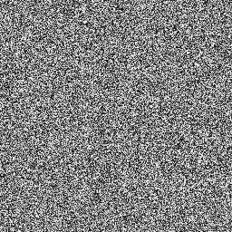

# Hybrid-Privacy-Preserving-Deep-Learning
Hybrid Privacy-Preserving Deep Learning is an encryption method that secures the information in the image.

Hybrid Privacy-Preserving Deep Learning is based on Homomorphic Encryption(HE), specifically Partially Homomorphic Encryption(PHE) and Somewhat Homomorphic Encryption(SHE). It does not rely on all the functions and properties of these two approaches but the construction of this technique depends on the extraction of certain properties of each according to its needs.

As the encryption approach is a trade-off between data privacy and model accuracy, DLaaS can run on encrypted images without knowing the context of the images and due to Hybrid_PPDL's ability to preserve the feature of images, DL Models can train on this type of images and show an accuracy result(good).

The main advantage of the Hybrid approach is to resolve the limitation of PHE and preserves the feature of images which is the role of the Homomorphic Encryption technique.

### Principal Functions Explanation 
| Function | Input | Output | Explanation |
| -------- | ----- | ------ | ----------- |
| public_key | |  | public_key is an object of class PublicKey |
| public_keyS | _lambda(security parameter of SHE that is modified by the user) and secret key | Public key list | Function can generate the public key list that is dependent on _lambda and secret key. it is included in SHE scheme. |
| Hybrid_encryption | _lambda(security parameter of SHE that is modified by the user),public_keyS(function call to generate the public key list. It includes in SHE approach) , plaintext( the pixel value is to encrypt) , public_key(the object include in PHE scheme).  |Encrypted pixel value | Function uses four different inputs to generate the new pixel value which is encrypted.
| ImgEncrypt | Same input of Hybrid_encryption but it differs on plaintext. In this function the plaintext is an images. | Encrypted image | Function calls the function Hybrid_encryption function to encrypt each image pixel and generate a new image that is encrypted and has the same size as the plain image.

Hybrid_PPDL has two steps: 
 
The first steps is to generate the public keys based on two different algorithms each one belongs to an approach (PHE and SHE).
 
The second steps is to generate an encrypted value.

The output of this approach is a new image generated as follows: 

